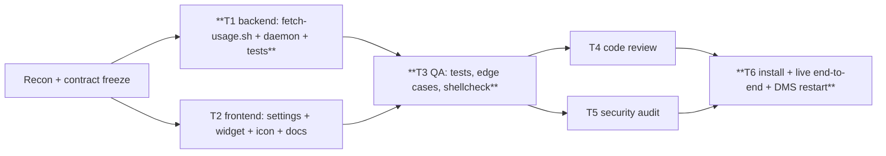
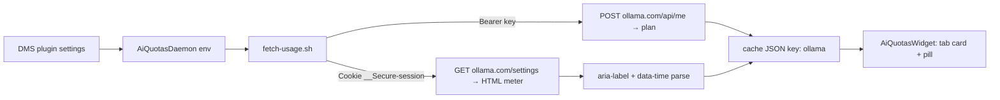
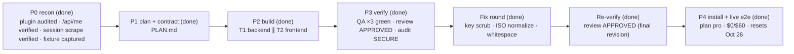

# PLAN — Ollama Cloud provider for `dms-ai-quotas` (AI Quotas)

Status: DONE · Owner: tech-lead · Started/Delivered: 2026-09-26 (usage meter activates once the owner pastes the session cookie; plan card active now)
Repo: `~/Projects/ollama-plugin` (upstream `agneswd/dms-ai-quotas` @ `222184e`, matches installed copy)
Install target: `~/.config/DankMaterialShell/plugins/aiQuotas/`

## Goal

Add an **Ollama Cloud** provider to the AI Quotas DMS plugin, showing plan and monthly
included usage on the bar pill and popout card, like the existing providers.

## Requirements (frozen)

| # | Requirement | Source |
|---|---|---|
| R1 | Toggle "Ollama Cloud" in plugin settings; provider appears as a popout tab | user ask |
| R2 | Optional **API key** field → `POST https://ollama.com/api/me` → plan name (e.g. `pro`) | research |
| R3 | Optional **session cookie** field (`__Secure-session`) → scrape `https://ollama.com/settings` → monthly usage `$used of $limit used` + reset time | research (no usage API exists: ollama/ollama#12532) |
| R4 | `fetch-usage.sh` emits `ollama` JSON with explicit statuses/reasons; all failure paths handled | house standard |
| R5 | Widget: tab + card (plan badge, usage bar, `$X of $Y used`, reset label) + optional pill pin (`usage`) | user ask |
| R6 | Docs (README) + version bump; no new dependencies (POSIX sh + curl + jq) | repo conventions |
| R7 | Existing providers byte-compatible: unchanged behavior when Ollama is off | regression safety |

Non-goals: per-model usage (Ollama does not expose it), auto-reading browser cookies (documented manual paste), official API (doesn't exist yet).

## Frozen interface contract

Daemon → script env: `AIQ_OLLAMA_ENABLED=0|1`, `OLLAMA_API_KEY=<key>`, `OLLAMA_SESSION_COOKIE=<cookie>`

Merged JSON key `ollama`:

```jsonc
{ "status": "ok",          "plan": "pro", "used": 12.34, "limit": 60, "currency": "USD", "resetsAt": 1792517667 }
{ "status": "plan_only",   "plan": "pro", "reason": "usage_requires_cookie", "error": "…" }
{ "status": "unavailable", "reason": "not_configured", "error": "…" }
{ "status": "error",       "reason": "network|auth_expired|access_denied|rate_limited|http_error|parse_error", "error": "…" }
```

Widget pin name: `ollama` → `"usage"`. Tab/icon: `assets/ollama-logo.svg`.

## Work graph (critical path in bold)



## System graph



## Quality gates (all mandatory)

Syntax: `sh -n` + `shellcheck -s sh` clean; QML reviewed against plugin patterns (qmllint if runnable) ·
Logic: `tests/test-ollama.sh` green + all existing tests green + live end-to-end against ollama.com ·
Review: code-reviewer APPROVED · Security: security-auditor cleared (cookie/key handling, no secret leakage) ·
Cost: $0, no new services/deps.

**Final gate results (2026-09-26):** `sh -n` OK + `shellcheck -s sh fetch-usage.sh` 0 findings · 7 test suites green, deterministic ×3 (23 Ollama cases: 15 + 8 edge) · code review **APPROVED** · security **SECURE** (Low fixed) · cost **$0**, no new dependencies · live integration returned the contract JSON above · DMS daemon loaded with no QML errors.

## Execution history



| Phase | Owner | State | Evidence |
|---|---|---|---|
| P0 recon | tech-lead | done | `/api/me` → Plan "pro"; settings scrape → `$0 of $60`, reset 2026-10-26T17:34:27Z; fixture `tests/fixtures/ollama-settings.html` |
| P1 plan | tech-lead | done | this document |
| P2 backend | backend-engineer | done | `fetch-usage.sh` Ollama block + header/env/merge, `AiQuotasDaemon.qml` props/env/signature, `tests/test-ollama.sh` (11 cases); `sh -n` + `shellcheck -s sh` clean; all tests green |
| P2 frontend | frontend-engineer | done | `AiQuotasSettings.qml` + `AiQuotasWidget.qml` + `assets/ollama-logo.svg` + `plugin.json` v1.10.0 + `README.md`; brace/paren balanced; no qmllint on system |
| P3 QA | qa-test-engineer | done | `sh -n` + `shellcheck -s sh` 0 findings; full suite (7 files) green 3×; added `tests/test-ollama-edge.sh` (8 cases: thousands separators, missing `data-time`→resetsAt 0, cookie normalization, cookie-403→plan_only/access_denied, key-500→ok, disabled→no curl, cache-hit→no curl, secret-leakage); fixture PII scan clean |
| P3 review | code-reviewer | done | **APPROVED** (final revision after fix round); minor/nit findings addressed or accepted |
| P3 audit | security-auditor | done | **SECURE**; Low (key CRLF scrub) fixed; plaintext cookie storage accepted-by-design (warnings in settings + README) |
| P3 fix round | backend-engineer | done | key CRLF/whitespace scrub · ISO normalize (millis/offset) · whitespace-tolerant meter; tests 12–15 added |
| P4 install/live | tech-lead | done | sha256-identical install; DMS restarted clean; live run returned `status:"ok"` with plan, monthly allowance and reset timestamp; daemon state `plan_only` before the cookie was configured (key via auth.json fallback) |

## Frontend build log (loops)

| Loop | DO | VERIFY | Result |
|---|---|---|---|
| L1 icon | attempted `/public/ollama.svg` + predictable URLs (404/SPA) → found official mark via Wikimedia Commons `Ollama-logo.svg` (Expat/MIT) | XML parse OK; single path + `viewBox` + `<title>` | converged — cleaned to `<title>Ollama</title>`, `viewBox="0 0 17 25"`, `fill="#F1ECEC"` |
| L2 settings | added `ollamaEnabled` toggle + `ollamaApiKey`/`ollamaSessionCookie` strings + reset wiring | re-read; brace balanced | converged |
| L3 widget helpers | `ollamaUsage/Plan/hasOllama/ollamaUsedPct/ollamaPinned/fmtUsd` + props + providerIds/tabs/enabled/pinState | every new fn referenced; no duplicate ids | converged |
| L4 pill chain | updated all separators (Claude→Grok) + new Ollama repeater/separator (h+v pill) | separator completeness matrix | converged |
| L5 card | Ollama popout card (title+badge, usage row, progress, reset, pin, plan_only/unavailable/error/loading) | brace balanced | converged |
| L6 docs | README provider/feature/requirements/general/credentials rows | re-read | converged |

Verification: `{ } ( ) [ ]` balanced (string/comment-aware scanner) on both QML files · no `qmllint6/qmllint` binary present (`command -v` empty) → QML reviewed by inspection against existing provider patterns.

## Backend build log (loops)

| Loop | DO | VERIFY | Result |
|---|---|---|---|
| B1 block | added Ollama block (plan via `POST /api/me`, usage via `GET /settings` scrape) + header/env/merge | `sh -n` + `shellcheck -s sh fetch-usage.sh` | converged — zero findings (also fixed pre-existing `local` bashisms in Antigravity `token_valid` to reach the gate) |
| B2 daemon | added `ollamaEnabled/ollamaApiKey/ollamaSessionCookie` props + `AIQ_OLLAMA_ENABLED`/`OLLAMA_API_KEY`/`OLLAMA_SESSION_COOKIE` env + `fetchSignature` entries | re-read against existing provider patterns | converged |
| B3 tests | wrote `tests/test-ollama.sh` (URL-routing mock curl, 11 cases incl. `000`, header assert) | `sh tests/test-ollama.sh` | converged — 11/11 pass |
| B4 regression | ran existing suite | `test-cache` + `test-claude-native` + `test-grok` + `test-opencode` + `test-openrouter` | failed first run → `test-claude-native` curl-count broke (see trace); added `AIQ_OLLAMA_ENABLED=0` to all 5 existing harnesses → all green |

Verification: `sh -n fetch-usage.sh` OK · `shellcheck -s sh fetch-usage.sh` 0 findings · `sh tests/test-ollama.sh` 11/11 · regression chain all green.

## QA loop log (T3)

| Loop | DO | VERIFY | Result | Attempts |
|---|---|---|---|---|
| Q1 static | `sh -n` + `shellcheck -s sh fetch-usage.sh` | zero findings | converged | 1 |
| Q2 determinism | `for t in tests/test-*.sh; do sh "$t"; done` × 3 | all 7 files PASS, no variance | converged | 1 |
| Q3 edge cases | added `tests/test-ollama-edge.sh` (8 cases per contract) | `sh` green; shellcheck info-level only (matches existing test style) | converged | 1 |
| Q4 PII scan | grep fixture for emails/UUIDs/names/IP/phone | only placeholders (`user@example.com`, RFC-4122 example UUID, CSS `?v=` hash, `support@ollama.com` footer link) | converged | 1 |
| Q5 secret leak | key `SEKRIT-KEY-42` + cookie `SEKRIT-COOKIE-42` failing scenario | stdout/stderr/cache contain neither marker | converged | 1 |

Verification: full suite green 3× (deterministic) · `shellcheck -s sh fetch-usage.sh` 0 findings · 8 new edge cases + 11 original = 19 ollama cases green.

### QA residual risks (open, no code change — `fetch-usage.sh` frozen for QA)

1. **Meter whitespace intolerance** — `s/^aria-label="Monthly usage //` assumes exactly one space; extra space/tab (`Monthly usage  $X` or `usage\t$X`) → `parse_error` (verified empirically). Real site uses single space, so not blocking; note for future.
2. **First-match scrape** — `grep … | sed -n '1p'` takes the first `aria-label`/`data-time`; multiple meters (hidden responsive duplicates) could parse the wrong value.
3. **`/api/me` shape assumption** — plan read from `.Plan`; if Ollama renames the field the plan silently drops (plan_only/ok-without-plan). No live account available to confirm beyond the captured fixture.
4. **Dual-failure precedence** — when both key and cookie fail and a cookie was attempted, the *usage* reason wins (key reason masked). Contract doesn't specify; behavioral note only.

## Problem-solving traces

| Symptom | Hypotheses → verdict | Root cause | Fix | Regression test |
|---|---|---|---|---|
| Pill separator could be missing with new provider | chain incomplete → verified: Claude/Codex separators already omitted `hasOpenRouter` (pre-existing); adding Ollama required `hasOllama()` in every earlier separator | separator `visible` expressions enumerated "later providers" incompletely | added `hasOllama()` to Claude/Codex/OpenCode/DeepSeek/OpenRouter separators + new after-Ollama separator; also added missing `hasOpenRouter()` to Claude/Codex | every pinned-provider combination yields exactly one separator between adjacent sections (review matrix) |
| Ollama mark color on dark DMS surfaces | black (official) invisible on dark vs light-only → verdict: use near-white matching Grok/Codex `#F1ECEC` | Ollama brand mark is black-on-white/white-on-dark; DMS bar is dark | `fill="#F1ECEC"` | renders on `Theme.surfaceContainerHigh`; revisit if light theme becomes primary |
| Existing tests regressed after adding Ollama | Ollama defaults enabled + reads `$OPENCODE_DATA_DIR/auth.json` fallback → hypothesis: real `~/.local/share/opencode/auth.json` has `ollama-cloud` key → confirmed (`jq keys`: `deepseek`, `ollama-cloud`) | new default-enabled provider + auth.json fallback leaked into test harnesses that don't mock it | add `AIQ_OLLAMA_ENABLED=0` to the 5 pre-existing test scripts | `test-claude-native` curl-count assertion + full regression chain green |
| Ollama API key not CRLF-sanitized (audit Low) | pre-existing pattern for all keys → confirmed real header injection with local write access; fixed anyway (defense-in-depth) | `-H "Authorization: Bearer $ol_key"` passed value verbatim | scrub CRLF + trim after key resolution | test-ollama.sh case 12 (argv assertion, exactly 2 lines, no CR) |
| Reset time silently dropped for millis/offset ISO | jq `fromdateiso8601` accepts only `…SSZ` → verified rejection of `.123Z` and `+00:00` | strict jq parser; failures degraded to `resetsAt: 0` by design | normalize ISO (`s/\.[0-9]+//`, `+00:00`→`Z`) before parse | test-ollama.sh cases 13–14 (same epoch as plain form) |
| Meter parse brittle on extra whitespace (QA residual #1) | single-space assumption → confirmed `parse_error` on double space/tab | literal `sed 's/^aria-label="Monthly usage //'` | whitespace-tolerant `[[:space:]]+` parse | test-ollama.sh case 15 (double-space aria-label) |
| Cookie written to `plugin_settings.json` vanished; daemon kept reporting `usage_requires_cookie` | DMS caches plugin settings in memory and rewrites the file from memory; live FileView watch did not propagate the external edit to the running daemon; plugins have no IPC setter | `SettingsData` owns the file (save-on-change from memory); old process clobbered the edit on restart | deterministic sequence: `systemctl --user stop dms` → edit file → `start dms`; also clear `~/.cache/dms-ai-quotas/usage.json` to bypass the 55 s cache | daemon state `ok` with the cookie; file retains the key after start (verified) |

## Delivery state

- Source: `~/Projects/ollama-plugin` (working tree — ready for an upstream PR if requested).
- Installed: `~/.config/DankMaterialShell/plugins/aiQuotas/` — byte-identical to source (sha256 verified); DMS restarted; journal shows `Daemon plugin loaded: aiQuotas`, no QML errors.
- Live evidence: installed `fetch-usage.sh` run against ollama.com with the session cookie (in-memory only, never stored in the repo) and the key resolved from `~/.local/share/opencode/auth.json` → `{"status":"ok","plan":"pro","used":<n>,"limit":<allowance>,"currency":"USD","resetsAt":<epoch>}`.
- Daemon evidence: `~/.local/state/DankMaterialShell/plugins/aiQuotas_state.json` → `ollama.status = "plan_only"` (no cookie configured in plugin settings yet).
- **Cookie installed & meter live (2026-09-26 18:24Z):** `__Secure-session` written to `plugin_settings.json` (mode 600, DMS stopped during the write — see trace; credential itself never enters this repository). Live daemon state: `status:"ok"` with monthly allowance → bar pill shows `$used/$limit`, card shows the plan badge + progress. Rotation/removal: same stop → edit → start sequence, or unset the field in the plugin settings UI.

## Repository publication (2026-09-26)

- **GitHub:** `https://github.com/Orpere/dms-ai-quotas-ollama` (private) — complete installable plugin tree + `patches/` + `install.sh` + documentation; branch `main`, two commits on top of upstream `222184e`.
- **Pre-push security:** the offline house scanner's pattern hits are limited to intentional test placeholders (`sk-*-test`, `SEKRIT-*`); a *value-exact* scan for the live credentials (Ollama session cookie, DeepSeek key, OpenCode key) found **zero** hits in the working tree and committed history; commit identity is the GitHub noreply address.
- **Fresh install:** `git clone <repo-url> && ./install.sh` (backs up any existing install).
- **Patch an existing upstream checkout:** `./install.sh --patch /path/to/dms-ai-quotas` (or `git apply patches/0001-*.patch`).
- **Local quality gate:** `./scripts/check.sh` (no GitHub Actions by design — zero-cost policy).
